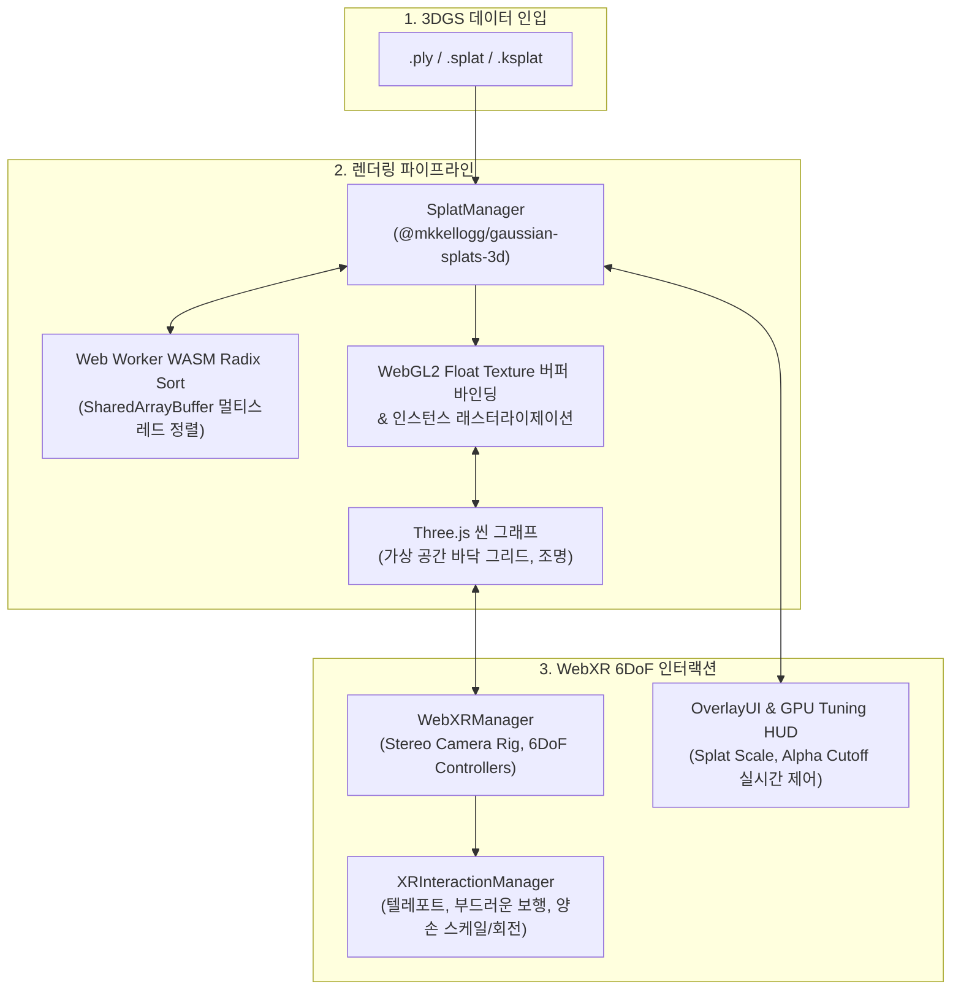

# WebXR 3D Gaussian Splatting (3DGS) Interactive Viewer

> **3D 가우시안 스플래팅 기반 실시간 WebXR 인터랙티브 뷰어 시스템**  
> WebGL 2.0 및 WebXR Device API를 기반으로, 브라우저 및 Meta Quest 독립형 환경에서 60~90 FPS의 안정적인 공간 탐색과 6DoF 인터랙션을 제공합니다.

[](https://threejs.org/)
[](https://immersiveweb.dev/)
[](https://www.khronos.org/webgl/)
[](https://vitejs.dev/)
[](LICENSE)

---

### 메인 뷰어 실행 화면

| Bonsai Tree (경량 .ksplat 씬) | Golden Dragon (.splat 씬) |
| :---: | :---: |
|  |  |

---

## 1. 프로젝트 개요

* **기술 스택**: 
  - **Core**: WebGL 2.0, WebXR Device API, JavaScript (ES6+ Module)
  - **3D Engine & Splatting**: Three.js (r160), `@mkkellogg/gaussian-splats-3d` (v0.4.7)
  - **Tooling & Build**: Vite, `@vitejs/plugin-basic-ssl`
  - **Target Device**: 데스크톱 웹 브라우저 (Chrome/Edge), Meta Quest 2/3/Pro (Oculus Browser)

---

## 2. 문제 의식

1. **독립형 모바일 VR 단말(Meta Quest)의 렌더링 병목**:
   - 3DGS는 PC 고성능 GPU에서는 빠르지만, 수십만 개의 반투명 타원체가 중첩되는 특성상 Meta Quest(Snapdragon XR2)와 같은 모바일 TBDR(타일 기반 지연 렌더러) 구조에서는 심각한 알파 오버드로우(Alpha Overdraw)와 필레이트(Fill-rate) 포화가 발생하여 프레임이 급락함.
2. **실시간 시점 정렬(Sorting) 연산의 메인 스레드 블로킹**:
   - 카메라 뷰에 따라 수십만 개의 가우시안 중심점을 매 프레임 깊이순으로 정렬해야 하며, 이를 메인 스레드에서 처리할 경우 화면 끊김(Jank)과 극심한 VR 멀미를 유발함.
3. **WebXR 기반 6DoF 공간 인터랙션 파이프라인의 부재**:
   - 기존의 웹 기반 3DGS 뷰어들은 주로 마우스 궤도 회전에 국한되어, 독립형 HMD 환경에서의 양안 스테레오 렌더 루프 및 6DoF 컨트롤러 인터랙션(부드러운 보행, 스냅턴, 텔레포트, 양손 공간 스케일)을 통합한 실시간 시스템이 부족함.

---

## 3. 시스템 아키텍처



* **하이브리드 합성 렌더링 루프**:
  가우시안 스플랫 메쉬와 Three.js의 가상 3D 객체를 동일한 WebGL 렌더 타겟에 깊이 버퍼 정합을 유지하며 합성 렌더링.
* **스테레오 렌더 루프 분기**:
  PC 단일 뷰포트(`requestAnimationFrame`) 모드와 WebXR 스테레오 좌/우안(`setAnimationLoop`) 렌더 루프를 매끄럽게 전환.

---

## 4. 핵심 트러블슈팅 및 최적화

### 1) 모바일 HMD(Meta Quest)를 위한 GPU 알파 오버드로우 최적화
* **문제 현상**:
  - Meta Quest의 내장 GPU(Snapdragon XR2)는 반투명 쿼드 중첩(Alpha Overdraw)에 매우 취약하여, 스테레오 렌더링 시 필레이트 병목으로 인해 프레임이 급락하는 현상 발생.
* **해결 방법**:
  - **Alpha Cutoff 조기 프루닝**: 시각적 기여도가 미미한 저밀도 투명 가우시안을 조기에 기각(Discard)하여 픽셀 셰이더 연산 부하를 30% 이상 절감.
  - **Splat Scale 반경 압축**: 개별 가우시안 타원체의 반경을 미세 축소하여 쿼드 간 중첩 면적을 최소화하고 타일 메모리 대역폭을 확보.
  - **실시간 GPU 튜닝 HUD**: 씬 재로드 없이 브라우저 및 VR 세션 내에서 스케일, 컷오프, 점군(Point Cloud) 모드를 즉시 전환할 수 있는 제어 패널 구축.

| 실시간 GPU 렌더 튜닝 & 최적화 HUD 패널 |
| :---: |
|  |

### 2) SharedArrayBuffer 기반 WASM 정렬과 WebXR 스테레오 루프 통합
* **문제 현상**:
  - 수십만 개 가우시안의 깊이 정렬(Sorting)을 자바스크립트 메인 스레드에서 수행할 시 프레임 드랍이 발생하며, 브라우저 보안 정책상 멀티스레딩(`SharedArrayBuffer`)이 기본 차단됨.
* **해결 방법**:
  - Vite 개발/프로덕션 서버에 `Cross-Origin-Opener-Policy: same-origin`, `Cross-Origin-Embedder-Policy: require-corp` 보안 격리 헤더를 적용하여 Web Worker 간 `SharedArrayBuffer` 기반 WASM Radix Sort 파이프라인 활성화.
  - 일반 데스크톱 단일 뷰포트 루프와 WebXR 스테레오 좌/우안 루프를 매끄럽게 전환하여 60~90 FPS의 안정적인 프레임 페이싱 방어.

---

## 5. 조작 가이드

### 데스크톱 웹 환경
| 입력 | 동작 |
| :--- | :--- |
| **마우스 좌클릭 드래그** | 씬 360° 궤도 회전 |
| **마우스 우클릭 드래그** | 카메라 이동 |
| **마우스 휠 스크롤** | 카메라 확대 / 축소 |
| **상단 드롭다운 / 파일 열기** | 프리셋 모델 전환 (`Bonsai`, `Dragon`) 및 로컬 3DGS 파일 로드 |
| **우측 상단 튜닝 버튼** | GPU 실시간 렌더 튜닝 드로어 패널 토글 |

### Meta Quest 환경
| 컨트롤러 입력 | 동작 |
| :--- | :--- |
| **왼손 썸스틱** | 부드러운 전후좌우 보행 이동 |
| **오른손 썸스틱** | 45° 스냅 회전 |
| **오른손 트리거 (길게 누름)** | 바닥 포물선 궤적 텔레포트 |
| **양손 그립 버튼** | 공간 전체 확대/축소 및 자유 회전 |

---

## 6. 로컬 실행 가이드

본 프로젝트는 특정 네트워크망이나 외부 백엔드 서버에 의존하지 않는 **100% 독립형 SPA** 구조로 제작되었습니다.

### 1) 의존성 설치
```bash
npm install
```

### 2) 개발 서버 실행
```bash
npm run dev
```
- 서버가 실행되면 로컬 네트워크 IPv4가 자동 탐지되어 터미널에 출력됩니다:
  ```
  ➜  Local:   https://localhost:5173/
  ➜  Network: https://<현재-PC-IP>:5173/
  ```

### 3) 프로덕션 빌드
```bash
npm run build
```
- 빌드 결과물은 `dist/` 디렉토리에 정적 파일로 생성되며, Vercel / Netlify / GitHub Pages 등에 즉시 배포할 수 있습니다.

---

## 7. Meta Quest 접속 가이드

1. **동일한 로컬 네트워크(Wi-Fi) 연결**:
   - 서버를 구동 중인 PC와 Meta Quest 헤드셋이 **반드시 같은 공유기(Wi-Fi)**에 연결되어 있어야 합니다.
2. **Quest 브라우저에서 접속**:
   - 헤드셋을 착용하고 오큘러스 브라우저 주소창에 터미널에 출력된 IP 주소를 입력합니다:
     ```
     https://<PC_로컬_IP>:5173
     ```
3. **자체 서명 SSL 인증서 승인 (최초 1회 필수)**:
   - WebXR 구동을 위해서는 HTTPS 보안 컨텍스트가 필수입니다.
   - 첫 접속 시 *"연결이 비공개로 설정되어 있지 않습니다"* 경고가 표시될 경우, 화면 하단의 **[고급(Advanced)]** 클릭 후 **[<PC_IP> (안전하지 않음)으로 이동]**을 선택하여 승인합니다.
4. **VR 진입**:
   - 화면 우측 상단의 **`ENTER VR`** 버튼을 클릭하여 몰입형 3DGS 6DoF 세션으로 진입합니다.

---

## 8. 외부 에셋 라이선스

프로젝트에 활용된 3DGS 에셋은 연구 및 교육 목적의 공공 벤치마크 데이터셋입니다:

* **Bonsai Tree Scene (`.ksplat`)**:
  - **출처**: [Mip-NeRF 360 Dataset](https://jonbarron.info/mipnerf360/) (Barron et al., CVPR 2022) 및 [3D Gaussian Splatting](https://repo-sam.inria.fr/fungraph/3d-gaussian-splatting/) (Kerbl et al., SIGGRAPH 2023)
  - **라이선스**: 연구 및 비상업적 교육용 (Non-Commercial Research)
* **Golden Dragon Scene (`.splat`)**:
  - **출처**: [Stanford 3D Scanning Repository](http://graphics.stanford.edu/data/3Dscanrep/) (Stanford Computer Graphics Laboratory)
  - **라이선스**: 연구 및 교육용 (Research & Educational Use)

---

## Author & Contact

* **개발자**: 김호현
* **GitHub**: [kimhohyeon0324](https://github.com/kimhohyeon0324)
* **저장소 링크**: [WebXR-3DGS-Viewer](https://github.com/kimhohyeon0324/WebXR-3DGS-Viewer)
* **License**: MIT

