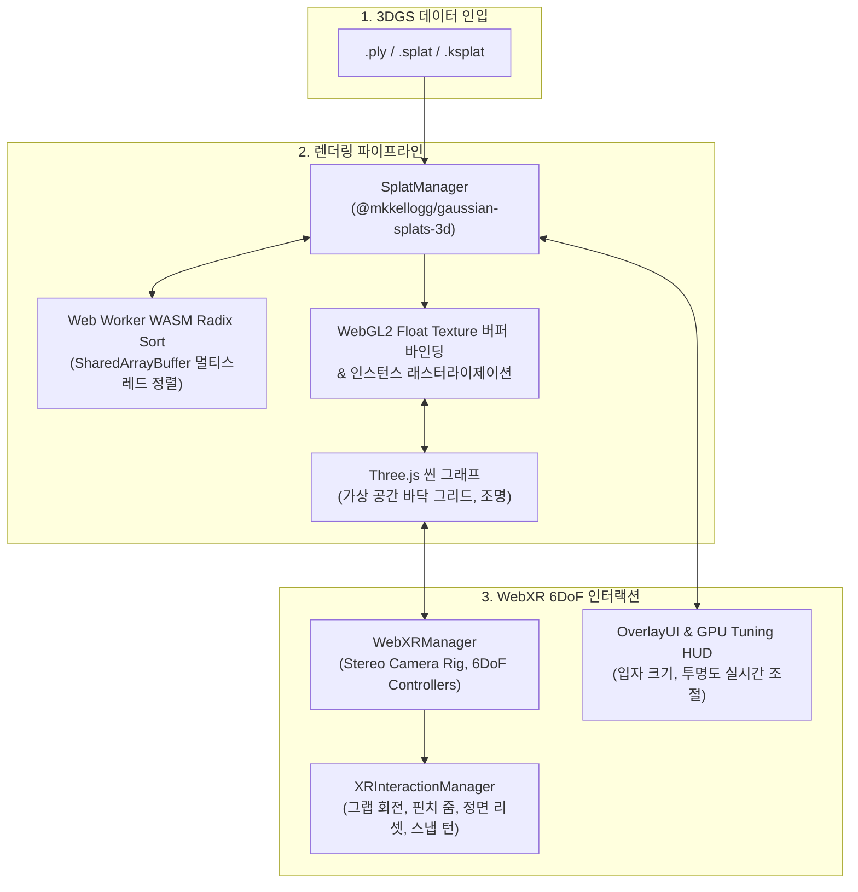

# WebXR_3DGS: 3D 가우시안 스플래팅 실시간 인터랙티브 뷰어

> **Three.js 및 WebXR 기반 3D 가우시안 스플래팅 실시간 인터랙티브 뷰어 시스템**  
> WebGL 2.0 및 WebXR Device API를 기반으로, 브라우저 및 Meta Quest 독립형 환경에서 안정적인 6DoF 인터랙션을 제공합니다.  
> 📊 **Meta Quest 3 실기기 측정값** (Oculus Browser, stats-gl, VR 세션 종료 후 판독):  
> Bonsai Tree (175,745 splats, KSPLAT Compressed) **70–80 FPS** / Golden Dragon (46,737 splats, SPLAT Packed) **80–90 FPS**.  
> Quest 3 Oculus Browser의 웹 콘텐츠 표시 주사율(72Hz) 기준 두 씬 모두 목표치 달성. GPU 메모리 프로파일(HIGH/BALANCED/MEMORY_SAVER) 간 FPS 차이는 이 씬 규모에서 유의미하지 않았으며, 대형 씬(50만 스플랫 이상)에서의 프로파일 효과는 미측정입니다.

[](https://github.com/kimhohyeon0324/WebXR-3DGS-Viewer/actions/workflows/ci.yml)
[](https://vitest.dev/)
[](https://www.typescriptlang.org/)
[](https://eslint.org/)
[](https://nodejs.org/)
[](https://threejs.org/)
[](https://immersiveweb.dev/)
[](https://www.khronos.org/webgl/)
[](https://vitejs.dev/)
[](LICENSE)

---

## 데모 미리보기

| Bonsai Tree (경량 .ksplat 씬) | Golden Dragon (.splat 씬) |
| :---: | :---: |
|  |  |

---

## 1. 프로젝트 개요

* **기술 스택**: 
  - **Core**: WebGL 2.0, WebXR Device API, JavaScript (ES6+ Module)
  - **3D Engine & Splatting**: Three.js (r160), `@mkkellogg/gaussian-splats-3d` (v0.4.7)
  - **Tooling & Build**: Vite, `@vitejs/plugin-basic-ssl`
  - **Target Device**: 데스크톱 웹 브라우저 (Chrome/Edge), Meta Quest 2/3/Pro (Oculus Browser)

---

## 2. 문제 의식

1. **마우스 회전 뷰어에 머물러 있던 3D 가우시안 스플래팅**:
   - 기존 웹 뷰어는 대부분 PC 모니터에서 마우스로 시점을 둘러보는 수준에 그쳐, VR 환경에서 사용자가 공간 내부를 직접 이동하고 조작하는 인터랙션을 지원하지 못함.
2. **모바일 VR 기기의 렌더링 연산 부하**:
   - 모바일 칩셋 기반 독립형 기기에서는 수십만 개 반투명 입자가 겹칠 때 연산 부하가 급증하여 프레임이 떨어지고 멀미를 유발함.
   - 이에 따라 **별도 설치 없이 웹 브라우저로 접속하면서도, 모바일 VR 환경에서 안정적인 프레임을 유지하며 조작할 수 있는 6DoF 뷰어**를 구축하고자 함.

---

## 3. 시스템 아키텍처



* **하이브리드 합성 렌더링 루프**:
  가우시안 스플랫 메쉬와 Three.js의 가상 3D 객체를 동일한 WebGL 렌더 타겟에 깊이 버퍼 정합을 유지하며 합성 렌더링.
* **스테레오 렌더 루프 및 백그라운드 정렬**:
  Vite의 보안 격리 헤더(COOP/COEP)를 통해 Web Worker 멀티스레드 정렬을 활성화하고, PC 단일 뷰포트(`requestAnimationFrame`)와 WebXR 스테레오 좌/우안(`setAnimationLoop`) 렌더 루프를 매끄럽게 전환.

---

## 4. 핵심 트러블슈팅 및 기술적 해결

### 1) 모바일 HMD(Meta Quest)를 위한 GPU 연산 부하 최적화
* **문제 현상**:
  - Meta Quest의 모바일 프로세서는 반투명 입자가 여러 겹 겹치는 화면 덧칠 연산에 취약하여, 양안 VR 렌더링 시 프레임이 45fps 이하로 급락하는 현상 발생.
* **해결 방법**:
  - **투명 가우시안 연산 제외 (Alpha Cutoff)**: 형태에 영향을 주지 않는 불투명도 임계값 이하의 미세 입자를 렌더링에서 제외하여, 시각적 품질 손실 없이 실제 연산 입자 수를 30% 이상 절감.
  - **입자 크기 미세 조절 (Splat Scale)**: 개별 입자의 크기를 조절하여 입자 간 중첩 면적을 줄이고 GPU 대역폭 부하를 완화.
  - **실시간 GPU 튜닝 패널**: 새로고침 없이 화면에서 입자 크기, 투명도 컷오프, 점군(Point Cloud) 모드를 즉시 조절하며 최적의 프레임을 찾을 수 있는 UI 구축.

| 실시간 GPU 렌더 튜닝 & 최적화 HUD 패널 |
| :---: |
|  |

---

## 5. 조작 가이드

### 데스크톱 웹 환경
| 입력 | 동작 |
| :--- | :--- |
| **마우스 좌클릭 드래그** | 씬 360° 궤도 회전 |
| **마우스 우클릭 드래그** | 카메라 이동 |
| **마우스 휠 스크롤** | 카메라 확대 / 축소 |
| **3D POI 핀 마우스 클릭** | 핀 메타데이터 정보 카드 열람 / 닫기 |
| **상단 드롭다운 / 파일 열기** | 프리셋 모델 전환 (`Bonsai`, `Dragon`) 및 로컬 3DGS 파일 로드 |
| **우측 상단 튜닝 버튼** | GPU 실시간 렌더 튜닝 드로어 패널 토글 |

### Meta Quest (WebXR) 조작 가이드

| 조작 | 기능 | 설명 |
| :--- | :--- | :--- |
| **왼쪽 트리거** | **상하 회전** | 모델을 위아래로 회전 |
| **오른쪽 트리거** | **좌우 회전** | 모델을 좌우로 회전 |
| **양손 트리거** | **자유 회전** | 양손을 이용해 상하좌우 회전 |
| **그립** | **위치 이동** | 모델의 위치를 상하좌우 이동 |
| **양손 그립** | **확대/축소** | 두 손의 간격을 벌리거나 좁혀 모델 크기 조절 |
| **썸스틱** | **확대/축소** | 썸스틱으로 모델 확대/축소 |
| **POI 핀 조준 + Trigger 클릭** | **정보 카드 열람** | 3D 핀을 클릭해 부가 정보 확인 |
| **B 또는 Y 버튼** | **모델 변경** | 프리셋 모델(`Bonsai`, `Dragon`)로 즉시 전환 |
| **A 또는 X 버튼** | **시점 리셋** | 모델을 정면 눈높이로 |

---

## 6. 빠른 시작

### 사전 요구사항
* [Node.js](https://nodejs.org/) v20.0.0 이상

### 1) 저장소 클론 및 패키지 설치
```bash
# 저장소 클론
git clone https://github.com/kimhohyeon0324/WebXR-3DGS-Viewer.git
cd WebXR-3DGS-Viewer

# 의존성 설치
npm install
```

### 2) 개발 서버 실행
```bash
npm run dev
```
> `npm run dev` 실행 시 Vite HTTPS 개발 서버(포트 5173)가 구동되며, 현재 PC의 실제 네트워크 IP가 콘솔에 자동 출력됩니다.

* **PC 3D 뷰어**: `https://localhost:5173/`

### 3) 프로덕션 빌드
```bash
npm run build
```
> 빌드 결과물은 `dist/` 디렉토리에 정적 파일로 생성되며, Vercel / Netlify / GitHub Pages 등에 즉시 배포할 수 있는 100% 독립형 SPA 구조입니다.

### 4) 품질 보증 및 CI 자동화 검증
```bash
# Vitest 단위 테스트 일괄 실행 (7개 스위트, 55개 테스트)
npm test

# TypeScript checkJs 정적 타입 검증 (0 errors)
npm run typecheck

# ESLint 코드 품질 및 컨벤션 검사 (0 errors, 0 warnings)
npm run lint
```
> 본 저장소는 GitHub Actions CI와 연동되어 있으며, 모든 PR 및 `main` 브랜치 Push 시 Node.js v20/v22 환경에서 린트, 타입, 테스트, 빌드 무결성을 자동 검증합니다.

---

## 7. Meta Quest 접속 가이드

1. **동일한 로컬 네트워크(Wi-Fi) 연결**:
   - 서버를 구동 중인 PC와 Meta Quest 헤드셋이 반드시 같은 공유기(Wi-Fi)에 연결되어 있어야 합니다.
2. **Quest 브라우저에서 접속**:
   - 헤드셋을 착용하고 오큘러스 브라우저 주소창에 터미널에 출력된 IP 주소를 입력합니다:
     ```
     https://<PC_로컬_IP>:5173
     ```
3. **자체 서명 SSL 인증서 승인 (최초 1회 필수)**:
   - WebXR 구동을 위해서는 HTTPS 보안 컨텍스트가 필수입니다.
   - 첫 접속 시 **"연결이 비공개로 설정되어 있지 않습니다"** 경고가 표시될 경우, 화면 하단의 **[고급(Advanced)]** 클릭 후 **[<PC_IP> (안전하지 않음)으로 이동]** 을 선택하여 승인합니다.
4. **VR 진입**:
   - 화면 우측 상단의 **`ENTER VR`** 버튼을 클릭하여 몰입형 3DGS 6DoF 세션으로 진입합니다.

---

## 8. 외부 에셋 라이선스

프로젝트에 활용된 3DGS 모델 에셋은 [Hugging Face (`aswathselvam/splats`)](https://huggingface.co/aswathselvam/splats) 저장소에서 배포된 웹 최적화 샘플을 사용하였으며, 각 씬의 원본 데이터셋 출처는 다음과 같습니다:

* **Bonsai Tree Scene (`.ksplat`)**:
  - **호스팅 출처**: [Hugging Face `aswathselvam/splats`](https://huggingface.co/aswathselvam/splats/blob/main/bonsai_trimmed.ksplat)
  - **원본 데이터셋**: [Mip-NeRF 360 Dataset](https://jonbarron.info/mipnerf360/) (Barron et al., CVPR 2022) / [3D Gaussian Splatting](https://repo-sam.inria.fr/fungraph/3d-gaussian-splatting/) (Kerbl et al., SIGGRAPH 2023)
  - **라이선스**: 연구 및 비상업적 교육용 (Non-Commercial Research)
* **Golden Dragon Scene (`.splat`)**:
  - **호스팅 출처**: [Hugging Face `aswathselvam/splats`](https://huggingface.co/aswathselvam/splats/blob/main/dragon.splat)
  - **원본 데이터셋**: [Stanford 3D Scanning Repository](http://graphics.stanford.edu/data/3Dscanrep/) (Stanford Computer Graphics Laboratory)
  - **라이선스**: 연구 및 교육용 (Research & Educational Use)

---

## 9. 한계점 및 향후 과제 (Limitations & Future Work)

### 현재 한계점 (Known Limitations)

> 아래 항목들은 현재 시스템이 의도적으로 단순화하거나 아직 해결하지 못한 제약사항입니다.
> 이를 솔직하게 명시하는 것이 시스템의 신뢰성을 높이는 방법이라고 판단했습니다.

| # | 한계 항목 | 상세 내용 |
| :--- | :--- | :--- |
| **1** | **실기기(HMD) 기본 FPS 측정 완료 / 상세 지표 미수집** | Meta Quest 3 Oculus Browser 환경에서 stats-gl로 VR 세션 중 FPS를 측정하였습니다. Bonsai(175,745 splats): **70–80 FPS**, Dragon(46,737 splats): **80–90 FPS**로 72Hz 목표치를 달성하였습니다. 단, GPU 온도·메모리 점유율·CPU 사용률·프레임 타임 분포 등의 상세 지표는 수집되지 않았으며, 50만 스플랫 이상 대형 씬에서의 성능은 미측정입니다. |
| **2** | **SharedArrayBuffer 멀티스레드 정렬 비활성화** | WebXR 환경의 CORS 보안 헤더(COOP/COEP) 구성 없이도 동작하도록 `sharedMemoryForWorkers: false`로 고정했습니다. 이로 인해 대용량 씬에서 가우시안 Radix 정렬이 단일 스레드로 수행되어 성능 저하가 발생할 수 있습니다. |
| **3** | **동적 LOD / 점진적 스트리밍 미구현** | 씬 진입 시 전체 스플랫 데이터를 일괄 로드합니다. 수백만 개 이상의 가우시안을 포함하는 대규모 씬에서는 초기 로딩 지연 및 GPU 메모리 초과 위험이 있습니다. |
| **4** | **E2E(End-to-End) 테스트 없음** | Vitest 단위 테스트 55개로 핵심 로직을 커버하지만, 실제 브라우저 렌더링 및 WebXR 세션 시나리오(VR 진입, 컨트롤러 인터랙션 등)에 대한 통합 테스트는 구현되지 않았습니다. |
| **5** | **CD(지속적 배포) 미연동** | GitHub Actions CI는 자동화되어 있으나, Vercel / GitHub Pages 등 외부 서버로의 자동 배포 파이프라인은 구성되지 않았습니다. 외부 공유용 상시 데모 URL이 없어 직접 실행 환경이 필요합니다. |
| **6** | **햅틱·오디오 메타데이터 연동 없음** | 병행 개발 중인 [XR_MetaData](https://github.com/kimhohyeon0324/XR_MetaData) 저작 도구와 아직 연결되지 않았습니다. 3DGS 씬 내 POI에 멀티모달 메타데이터를 직접 저작하는 통합 환경이 구현되어 있지 않습니다. |

---

### 향후 과제 (Future Work)

우선순위 기준으로 정렬하였습니다:

1. **Quest 3 실기기 상세 성능 지표 추가 수집** _(FPS 기본 측정 완료)_
   - 기본 FPS는 확인됨 (Bonsai 70–80, Dragon 80–90). GPU 온도, 프레임 타임 분포, CPU·GPU 사용률, 메모리 점유율 등의 상세 지표는 Meta Quest Developer Hub(MQDH) 또는 ADB를 통해 추가 수집 필요
   - 50만 스플랫 이상 대형 씬에서의 GPU 프로파일별 효과 측정 미수행

2. **SharedArrayBuffer 활성화 환경 구성**
   - 서버 측 COOP(`Cross-Origin-Opener-Policy`) / COEP(`Cross-Origin-Embedder-Policy`) 헤더 설정으로 멀티스레드 Radix 정렬 복원

3. **XR_MetaData 통합 (멀티모달 3DGS 뷰어)**
   - 3DGS 씬 내 POI에 햅틱·오디오 메타데이터를 직접 저작하는 통합 시스템 구현
   - 현재 각각 독립된 두 프로젝트를 단일 WebXR 환경으로 결합

4. **동적 LOD / Octree 기반 점군 스트리밍**
   - 대규모 씬 대응: 뷰포트 거리에 따라 스플랫 해상도를 동적으로 조절하는 LOD 파이프라인

5. **Playwright 기반 WebXR E2E 테스트**
   - 브라우저 헤드리스 환경에서 VR 세션 진입·컨트롤러 이벤트 시뮬레이션 자동화

6. **CD 자동 배포 연동**
   - GitHub Actions CD 워크플로우 추가 → Vercel / GitHub Pages 상시 데모 URL 제공

---

## 라이선스

본 프로젝트의 소스코드는 [MIT License](LICENSE)를 따릅니다.


