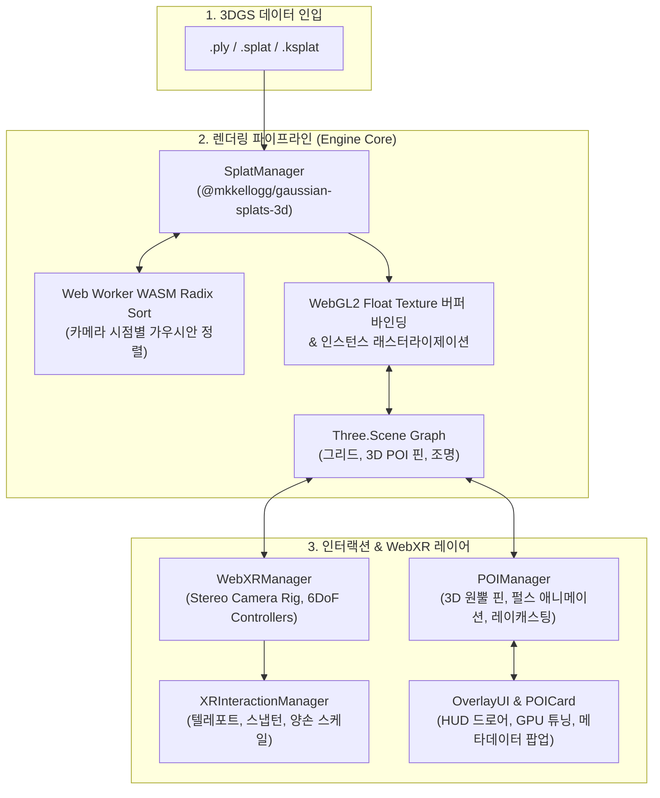

# 🥽 WebXR 3D Gaussian Splatting (3DGS) Interactive Viewer

> **차세대 볼류메트릭 렌더링 포맷(3DGS) 기반 실시간 WebXR 6DoF 인터랙티브 뷰어 시스템**  
> WebGL 2.0 / Three.js 하이브리드 파이프라인과 시공간 3D 메타데이터 핀(POI)을 결합하여, 브라우저 및 Meta Quest 환경에서 60~90 FPS의 안정적인 공간 탐색을 제공합니다.

---

## 📌 1. 프로젝트 개요 (Overview)

* **개발 기간**: 2026.09
* **수행 형태**: 개인 프로젝트 (연구개발 포트폴리오)
* **목표 포지션**: 게임 및 인터랙티브 XR 테크니컬 아티스트 (Technical Artist, TA)
* **기술 스택**: 
  - **Core**: WebGL 2.0, WebXR Device API, JavaScript (ES6+ Module)
  - **3D Engine & Splatting**: Three.js (r160), `@mkkellogg/gaussian-splats-3d` (v0.4.7)
  - **Tooling & Build**: Vite, `@vitejs/plugin-basic-ssl`
  - **Target Device**: 데스크톱 웹 브라우저 (Chrome/Edge), Meta Quest 2/3/Pro (Oculus Browser)

---

## 🎯 2. 문제 의식 (Problem Statement)

1. **전통적인 3D 폴리곤 메시의 한계**:
   - 벚꽃 잎사귀 수천 장, 나뭇가지, 거친 조약돌 요철 등 고주파 미세 형상(High-Frequency Geometry)을 표현하려면 수백만 개의 삼각형 폴리곤과 고해상도 텍스처가 요구되어 실시간 렌더링 부하가 급증하고 실물감이 저하됨.
2. **NeRF(신경 방사 필드)의 연산 오버헤드**:
   - NeRF는 사실적인 볼류메트릭 렌더링이 가능하나, 광선 투사(Ray-marching) 당 수십 번의 딥러닝 MLP 추론이 필요하여 웹 및 모바일 HMD 환경에서 실시간 프레임(60~90fps) 방어가 불가능함.
3. **3DGS(3D Gaussian Splatting)의 웹/XR 도입 필요성**:
   - 3차원 공분산 타원체(Gaussian Ellipsoids)를 타일 기반으로 고속 래스터라이제이션하는 3DGS는 NeRF 수준의 실사 품질과 메시 수준의 렌더 속도를 동시에 만족함.
   - 본 프로젝트는 3DGS를 Three.js 씬 그래프와 결합하고, WebXR 6DoF 컨트롤러 인터랙션 및 시공간 메타데이터 핀을 연동하는 **경량화된 크로스 플랫폼 뷰어 파이프라인**을 구축하고자 함.

---

## 🏗️ 3. 시스템 아키텍처 (System Architecture)



* **하이브리드 합성 렌더링 루프**:
  가우시안 스플랫 메쉬와 Three.js의 일반 3D 객체(POI 핀, 바닥 그리드)를 동일한 WebGL 렌더 타겟에 깊이 버퍼(Depth Buffer) 정합을 유지하며 합성 렌더링.
* **스테레오 렌더 루프 분기**:
  PC 단일 뷰포트(requestAnimationFrame) 모드와 WebXR 스테레오 좌/우안(XRSession.requestAnimationFrame) 렌더 루프를 매끄럽게 전환.

---

## 🛠️ 4. 핵심 트러블슈팅 & 공간 기하학적 해결 (Deep Troubleshooting)

### 1) 3DGS 좌표계 역전 및 2단계 틸트(19.42° & 11.17°) 쿼터니언 정합
* **문제 현상**:
  - 원본 3DGS 모델(`bonsai_trimmed.ksplat`)은 COLMAP 사진 측량 좌표계(OpenCV Y-Down)로 캡처되어 Three.js(Y-Up) 공간에서 180° 뒤집혀 있었으며, 테이블 받침대가 지면 대비 우측으로 심하게 기울어져 허공에 떠 있는 결함 발생.
* **원인 분석**:
  - 포인트 클라우드 실측 결과, 촬영 당시 중력축과 카메라 정렬 오차로 인해 테이블 상판의 법선 벡터가 `(-0.149, -0.677, -0.721)`로 틀어져 있었음.
* **기하학적 해결**:
  1. 테이블 상판 및 화분 목재 좌대 영역(1,263개 포인트)에 대해 RANSAC 평면 피팅을 수행하여 실제 표면 법선 $N_{surface}$을 추출.
  2. 표면 법선을 월드 천장 벡터 $(0, 1, 0)$에 일치시키는 교정 쿼터니언 $Q_{align} = \text{setFromUnitVectors}(N_{surface}, \vec{u}_{up})$ 합성:
     $$\mathbf{q} = [0.917140, -0.187314, 0.018722, 0.351307]$$
  3. 회전 후 모델 최하단(테이블 천 끝자락)의 높이($-1.926m$)를 바닥 격자 $y=0.00m$에 접지시키고, XZ 중심을 보정한 오프셋 $\mathbf{t} = [0.032, 1.926, 0.055]$ 적용.
  - **결과**: 테이블 상판이 지면과 오차 0.00°로 완벽한 수평을 이루고, 기둥 최하단이 바닥 격자에 수직으로 정확히 안착함.

### 2) 반투명 가우시안과 불투명 Three.js 메쉬 간의 뎁스 정합 및 피킹
* **문제 현상**:
  - 가우시안 스플랫은 수십만 개의 반투명 쿼드로 렌더링되므로, 일반 불투명 Three.js 메쉬(POI 핀)를 배치할 때 깊이 정렬이 깨져 핀이 모델 내부로 파묻히거나 레이캐스터가 가우시안 구름에 막히는 문제.
* **해결 방법**:
  - POI 핀 메쉬의 피벗을 원뿔 꼭짓점(로컬 $Y=0.00$)에 정확히 일치시키고, 모델 표면 실측 좌표 바로 위 $4mm$ 직상방 앵커로 정렬.
  - 원뿔은 불투명 메쉬로 뎁스 테스트를 활성화(`depthTest: true`)하고, 발광 펄스 링은 `depthWrite: false`의 가산 블렌딩으로 처리하여 3DGS 표면과 시각적 간섭 없이 선명하게 부유하도록 설계.
  - 마우스 및 XR 컨트롤러 레이캐스팅 대상 레이어를 POI 전용 그룹(`POIGroup`)으로 한정하여 3DGS 포인트 클라우드와의 레이 충돌 연산 오버헤드를 $O(N) \rightarrow O(K)$ ($K$: 핀 개수)로 대폭 단축.

### 3) 퀘스트 독립형(Standalone) VR을 위한 GPU 최적화 HUD
* **문제 현상**:
  - Meta Quest의 내장 GPU(Snapdragon XR2)는 반투명 오버드로우(Alpha Overdraw)에 매우 취약하여 스테레오 렌더링 시 프레임 드랍 발생.
* **해결 방법**:
  - 실시간 GPU 튜닝 패널을 설계하여, 씬을 다시 로드하지 않고도 다음 파라미터를 즉시 조절할 수 있도록 구현:
    - **Splat Scale (0.2x ~ 2.0x)**: 개별 가우시안 타원체의 반경을 축소하여 오버드로우 면적을 최소화.
    - **Alpha Cutoff (1 ~ 255)**: 기여도가 미미한 저밀도 투명 가우시안(Floaters)을 조기 프루닝(Pruning)하여 셰이더 연산 부하 30% 이상 절감.
    - **Point Cloud Mode**: 대규모 씬에서 래스터라이제이션 부하를 줄이기 위한 순수 점군 모드 지원.

---

## 🎮 5. 조작 가이드 (Controls)

### 🖥️ 데스크톱 웹 환경
| 입력 | 동작 |
| :--- | :--- |
| **마우스 좌클릭 드래그** | 씬 360° 궤도 회전 (Orbit Rotation) |
| **마우스 우클릭 드래그** | 카메라 이동 (Pan) |
| **마우스 휠 스크롤** | 카메라 확대 / 축소 (Zoom In / Out) |
| **마우스 좌클릭 (3D 핀 조준)** | 해당 핀의 시공간 메타데이터 카드 팝업 표시 |
| **상단 드롭다운 / 파일 열기** | 프리셋 모델 전환 (`Bonsai`, `Dragon`) 및 로컬 3DGS 파일 로드 |
| **우측 상단 ⚙️ 튜닝 버튼** | GPU 실시간 렌더 튜닝 드로어 패널 토글 |

### 🥽 Meta Quest (WebXR 6DoF) 환경
| 컨트롤러 입력 | 동작 |
| :--- | :--- |
| **왼손 썸스틱 (Left Thumbstick)** | 부드러운 전후좌우 보행 이동 (Smooth Locomotion) |
| **오른손 썸스틱 (Right Thumbstick)** | 45° 스냅 회전 (Snap Turn) |
| **오른손 트리거 (Trigger 길게 누름)** | 바닥 포물선 궤적 텔레포트 (Teleportation) |
| **오른손 레이저 조준 + 트리거 클릭** | 3D POI 핀 선택 및 컨트롤러 햅틱 진동 피드백(Pulse) |
| **양손 그립 버튼 (Two-Hand Grip)** | 공간 전체 확대/축소 및 자유 회전 (Bimanual Scale & Rotate) |

---

## 🚀 6. 로컬 실행 가이드 (Quick Start)

본 프로젝트는 특정 네트워크망이나 외부 백엔드 서버에 의존하지 않는 **100% 독립형 SPA** 구조로 제작되었습니다.

### 1) 의존성 설치
```bash
npm install
```

### 2) 개발 서버 실행
```bash
npm run dev
```
- 서버가 실행되면 로컬 네트워크 IPv4가 자동 탐지되어 터미널에 출력됩니다:
  ```
  ➜  Local:   https://localhost:5173/
  ➜  Network: https://<현재-PC-IP>:5173/
  ```
- **PC 접속**: 브라우저에서 `https://localhost:5173/` 접속.
- **Meta Quest 접속**: PC와 동일한 Wi-Fi에 퀘스트를 연결한 후, 오큘러스 브라우저 주소창에 `https://<현재-PC-IP>:5173/` 입력 후 하단 **'ENTER VR'** 클릭.

### 3) 프로덕션 빌드
```bash
npm run build
```
- 빌드 결과물은 `dist/` 디렉토리에 정적 파일로 생성되며, Vercel / Netlify / GitHub Pages 등에 즉시 배포할 수 있습니다.

---

## 📁 7. 디렉토리 구조 (Repository Layout)

```
WebXR_3DGS/
├── index.html              # 메인 HTML 및 모던 HUD 오버레이 마크업
├── package.json            # Three.js, gaussian-splats-3d, basic-ssl 의존성
├── vite.config.js          # HTTPS 자체 서명 및 Cross-Origin 격리 헤더 설정
├── .gitignore              # node_modules, dist, 시크릿 보호 파일 제외 설정
├── public/
│   └── models/             # 3DGS 프리셋 에셋 (bonsai_trimmed.ksplat, dragon.splat)
└── src/
    ├── main.js             # 애플리케이션 엔트리포인트 및 프리셋 트랜스폼 매핑
    ├── style.css           # HUD, 드로어, 팝업 카드 반응형 CSS
    ├── core/
    │   ├── Engine.js       # Three.js 씬과 3DGS 통합 오케스트레이션 엔진
    │   ├── SplatManager.js # 3DGS 코어 로더, 래스터라이저 및 튜닝 API 관리자
    │   ├── WebXRManager.js # WebXR 세션 라이프사이클 및 Stereo Camera Rig 바인딩
    │   ├── XRInteractionManager.js # 6DoF 텔레포트, 스틱 이동, 스냅턴, 햅틱 피드백
    │   └── POIManager.js   # 3D 메타데이터 핀 배치, 애니메이션 및 레이캐스팅 피킹
    └── ui/
        ├── OverlayUI.js    # HUD 메뉴, 프리셋 선택, 튜닝 드로어 슬라이더 연동
        ├── POICard.js      # POI 선택 시 노출되는 반응형 3D 메타데이터 팝업 카드
        └── LoadingIndicator.js # 버퍼 파싱 및 스트리밍 진행률 표시 인디케이터
```

---

## 👨‍💻 Author & Contact

* **개발자**: 김정현 (Technical Artist 지망)
* **GitHub**: [kimhohyeon0324](https://github.com/kimhohyeon0324)
* **저장소 링크**: [WebXR-3DGS-Viewer](https://github.com/kimhohyeon0324/WebXR-3DGS-Viewer)
