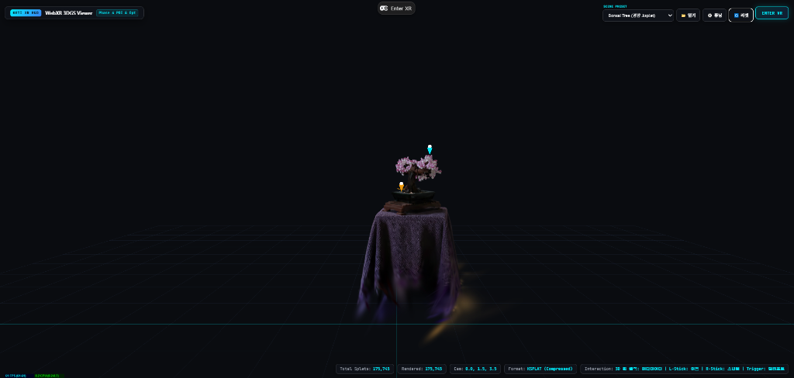
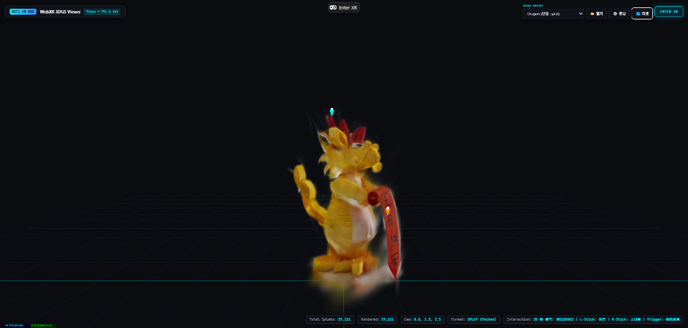
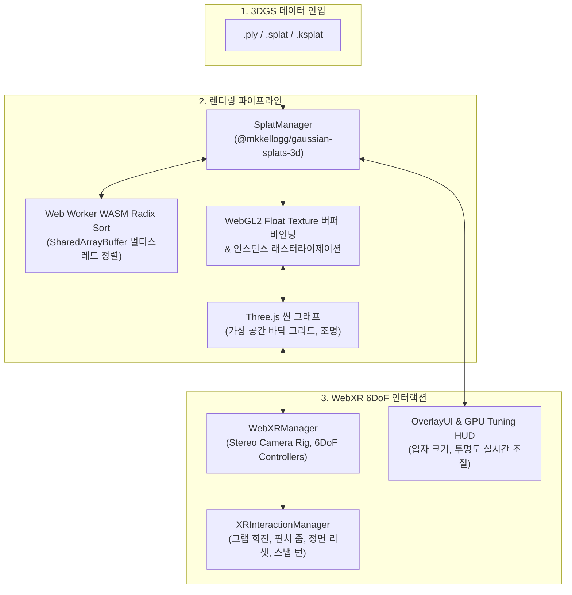
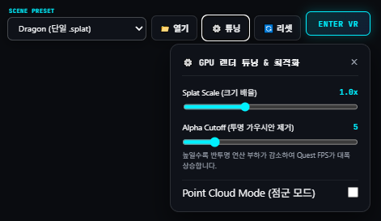

# WebXR_3DGS: 3D 가우시안 스플래팅 실시간 인터랙티브 뷰어

> **Three.js 및 WebXR 기반 3D 가우시안 스플래팅 실시간 인터랙티브 뷰어 시스템**  
> WebGL 2.0 및 WebXR Device API를 기반으로, 브라우저 및 Meta Quest 독립형 환경에서 60~90 FPS의 안정적인 공간 탐색과 6DoF 인터랙션을 제공합니다.

[](https://nodejs.org/)
[](https://threejs.org/)
[](https://immersiveweb.dev/)
[](https://www.khronos.org/webgl/)
[](https://vitejs.dev/)
[](LICENSE)

---

## 데모 미리보기

| Bonsai Tree (경량 .ksplat 씬) | Golden Dragon (.splat 씬) |
| :---: | :---: |
|  |  |

---

## 1. 프로젝트 개요

* **기술 스택**: 
  - **Core**: WebGL 2.0, WebXR Device API, JavaScript (ES6+ Module)
  - **3D Engine & Splatting**: Three.js (r160), `@mkkellogg/gaussian-splats-3d` (v0.4.7)
  - **Tooling & Build**: Vite, `@vitejs/plugin-basic-ssl`
  - **Target Device**: 데스크톱 웹 브라우저 (Chrome/Edge), Meta Quest 2/3/Pro (Oculus Browser)

---

## 2. 문제 의식

1. **마우스 회전 뷰어에 머물러 있던 3D 가우시안 스플래팅**:
   - 기존 웹 뷰어는 대부분 PC 모니터에서 마우스로 시점을 둘러보는 수준에 그쳐, VR 환경에서 사용자가 공간 내부를 직접 이동하고 조작하는 인터랙션을 지원하지 못함.
2. **모바일 VR 기기의 렌더링 연산 부하**:
   - 모바일 칩셋 기반 독립형 기기에서는 수십만 개 반투명 입자가 겹칠 때 연산 부하가 급증하여 프레임이 떨어지고 멀미를 유발함.
   - 이에 따라 **별도 설치 없이 웹 브라우저로 접속하면서도, 모바일 VR 환경에서 안정적인 프레임을 유지하며 조작할 수 있는 6DoF 뷰어**를 구축하고자 함.

---

## 3. 시스템 아키텍처



* **하이브리드 합성 렌더링 루프**:
  가우시안 스플랫 메쉬와 Three.js의 가상 3D 객체를 동일한 WebGL 렌더 타겟에 깊이 버퍼 정합을 유지하며 합성 렌더링.
* **스테레오 렌더 루프 및 백그라운드 정렬**:
  Vite의 보안 격리 헤더(COOP/COEP)를 통해 Web Worker 멀티스레드 정렬을 활성화하고, PC 단일 뷰포트(`requestAnimationFrame`)와 WebXR 스테레오 좌/우안(`setAnimationLoop`) 렌더 루프를 매끄럽게 전환.

---

## 4. 핵심 트러블슈팅 및 기술적 해결

### 1) 모바일 HMD(Meta Quest)를 위한 GPU 연산 부하 최적화
* **문제 현상**:
  - Meta Quest의 모바일 프로세서는 반투명 입자가 여러 겹 겹치는 화면 덧칠 연산에 취약하여, 양안 VR 렌더링 시 프레임이 45fps 이하로 급락하는 현상 발생.
* **해결 방법**:
  - **투명 가우시안 연산 제외 (Alpha Cutoff)**: 형태에 영향을 주지 않는 불투명도 임계값 이하의 미세 입자를 렌더링에서 제외하여, 시각적 품질 손실 없이 실제 연산 입자 수를 30% 이상 절감.
  - **입자 크기 미세 조절 (Splat Scale)**: 개별 입자의 크기를 조절하여 입자 간 중첩 면적을 줄이고 GPU 대역폭 부하를 완화.
  - **실시간 GPU 튜닝 패널**: 새로고침 없이 화면에서 입자 크기, 투명도 컷오프, 점군(Point Cloud) 모드를 즉시 조절하며 최적의 프레임을 찾을 수 있는 UI 구축.

| 실시간 GPU 렌더 튜닝 & 최적화 HUD 패널 |
| :---: |
|  |

---

## 5. 조작 가이드

### 데스크톱 웹 환경
| 입력 | 동작 |
| :--- | :--- |
| **마우스 좌클릭 드래그** | 씬 360° 궤도 회전 |
| **마우스 우클릭 드래그** | 카메라 이동 |
| **마우스 휠 스크롤** | 카메라 확대 / 축소 |
| **3D POI 핀 마우스 클릭** | 핀 메타데이터 정보 카드 열람 / 닫기 |
| **상단 드롭다운 / 파일 열기** | 프리셋 모델 전환 (`Bonsai`, `Dragon`) 및 로컬 3DGS 파일 로드 |
| **우측 상단 튜닝 버튼** | GPU 실시간 렌더 튜닝 드로어 패널 토글 |

### Meta Quest (WebXR) 환경
| 컨트롤러 입력 | 물리 동작 및 피드백 | 상세 설명 |
| :--- | :--- | :--- |
| **Grip(손잡이) 또는 Trigger(트리거) 쥐기**<br>*(한 손)* | **1:1 자유 공간 이동 (Translation)**<br>*(에메랄드 레이저 & 햅틱 펄스)* | 손의 6DoF 이동 변위를 1:1로 추종합니다. 손목 회전(Pronation/Supination) 간섭을 차단하여 원하는 위치에 흔들림 없이 정밀하게 배치합니다. |
| **Grip 또는 Trigger 동시 쥐기**<br>*(양손)* | **3D 회전 + 3D 핀치 줌 + 공간 이동**<br>*(양손 동시 햅틱 피드백)* | • **3D 회전**: 양손을 잡고 돌려 **오브젝트 로컬 중심 회전**<br>• **확대/축소**: 두 손 간격을 벌리거나 좁혀 **오브젝트 중심 줌인/줌아웃** (한계 도달 시 경고 햅틱)<br>• **공간 이동**: 두 손을 함께 움직여 **두 손의 중심점 추종 이동** |
| **Trigger 단발 클릭**<br>*(POI 핀 조준 시)* | **VR 3D 어노테이션 정보 카드 토글**<br>*(골드 레이저 & 클릭 햅틱)* | 레이저가 POI 핀을 조준(Hover)하면 골드 색상으로 빛나며 손끝에 미세 햅틱이 전달되고, 방아쇠를 당기면 3D 정보 카드가 열립니다. |
| **A 버튼(우) 또는 X 버튼(좌) 클릭** | **시선 정면 즉시 복귀 (Recenter)**<br>*(더블 햅틱 펄스)* | 모델을 놓치거나 시야 밖으로 멀어졌을 때, 현재 사용자의 정면 1.3m 눈높이로 모델을 부드럽게 재배치하고 크기/각도를 초기화합니다. |

> **인체공학적 설계 원칙 (Ergonomic Principles)**:
> 1. **스마트 하이브리드 입력**: 물체를 직접 쥐는 가장 자연스러운 동작인 **Grip(중지 손잡이) 버튼**과 **Trigger(검지 방아쇠)** 모두 잡기를 지원합니다. 특히 POI 핀 조준 시에는 Trigger가 '클릭'으로 명확히 인식되어, 핀을 누르려다 모델이 튀는 실수를 100% 원천 차단합니다.
> 2. **오브젝트 중심 고정 피벗**: 회전 및 확대/축소의 피벗 축이 항상 모델 자체의 로컬 중심에 고정되어 있어, 1m 이상 떨어진 원거리에서도 모델이 손 주위를 공전(Orbit)하며 시야 밖으로 날아가지 않습니다.
> 3. **물리 지수 감쇠 스무딩 (Exponential Damping)**: 인체의 60~90Hz 미세 손떨림을 필터링하여, 마치 고급 물체를 다루듯 매끄럽고 안정적인 조작감을 제공합니다.
> 4. **손끝으로 전해지는 정밀 햅틱 (Haptic Affordance)**: 잡기, 놓기, 조준, 클릭, 한계 도달 등 모든 인터랙션 순간마다 고유한 진동 피드백을 전달하여 몰입감을 극대화합니다.

---

## 6. 빠른 시작

### 사전 요구사항
* [Node.js](https://nodejs.org/) v20.0.0 이상

### 1) 저장소 클론 및 패키지 설치
```bash
# 저장소 클론
git clone https://github.com/kimhohyeon0324/WebXR-3DGS-Viewer.git
cd WebXR-3DGS-Viewer

# 의존성 설치
npm install
```

### 2) 개발 서버 실행
```bash
npm run dev
```
> `npm run dev` 실행 시 Vite HTTPS 개발 서버(포트 5173)가 구동되며, 현재 PC의 실제 네트워크 IP가 콘솔에 자동 출력됩니다.

* **PC 3D 뷰어**: `https://localhost:5173/`

### 3) 프로덕션 빌드
```bash
npm run build
```
> 빌드 결과물은 `dist/` 디렉토리에 정적 파일로 생성되며, Vercel / Netlify / GitHub Pages 등에 즉시 배포할 수 있는 100% 독립형 SPA 구조입니다.

---

## 7. Meta Quest 접속 가이드

1. **동일한 로컬 네트워크(Wi-Fi) 연결**:
   - 서버를 구동 중인 PC와 Meta Quest 헤드셋이 반드시 같은 공유기(Wi-Fi)에 연결되어 있어야 합니다.
2. **Quest 브라우저에서 접속**:
   - 헤드셋을 착용하고 오큘러스 브라우저 주소창에 터미널에 출력된 IP 주소를 입력합니다:
     ```
     https://<PC_로컬_IP>:5173
     ```
3. **자체 서명 SSL 인증서 승인 (최초 1회 필수)**:
   - WebXR 구동을 위해서는 HTTPS 보안 컨텍스트가 필수입니다.
   - 첫 접속 시 **"연결이 비공개로 설정되어 있지 않습니다"** 경고가 표시될 경우, 화면 하단의 **[고급(Advanced)]** 클릭 후 **[<PC_IP> (안전하지 않음)으로 이동]** 을 선택하여 승인합니다.
4. **VR 진입**:
   - 화면 우측 상단의 **`ENTER VR`** 버튼을 클릭하여 몰입형 3DGS 6DoF 세션으로 진입합니다.

---

## 8. 외부 에셋 라이선스

프로젝트에 활용된 3DGS 모델 에셋은 [Hugging Face (`aswathselvam/splats`)](https://huggingface.co/aswathselvam/splats) 저장소에서 배포된 웹 최적화 샘플을 사용하였으며, 각 씬의 원본 데이터셋 출처는 다음과 같습니다:

* **Bonsai Tree Scene (`.ksplat`)**:
  - **호스팅 출처**: [Hugging Face `aswathselvam/splats`](https://huggingface.co/aswathselvam/splats/blob/main/bonsai_trimmed.ksplat)
  - **원본 데이터셋**: [Mip-NeRF 360 Dataset](https://jonbarron.info/mipnerf360/) (Barron et al., CVPR 2022) / [3D Gaussian Splatting](https://repo-sam.inria.fr/fungraph/3d-gaussian-splatting/) (Kerbl et al., SIGGRAPH 2023)
  - **라이선스**: 연구 및 비상업적 교육용 (Non-Commercial Research)
* **Golden Dragon Scene (`.splat`)**:
  - **호스팅 출처**: [Hugging Face `aswathselvam/splats`](https://huggingface.co/aswathselvam/splats/blob/main/dragon.splat)
  - **원본 데이터셋**: [Stanford 3D Scanning Repository](http://graphics.stanford.edu/data/3Dscanrep/) (Stanford Computer Graphics Laboratory)
  - **라이선스**: 연구 및 교육용 (Research & Educational Use)

---

## 라이선스

본 프로젝트의 소스코드는 [MIT License](LICENSE)를 따릅니다.


